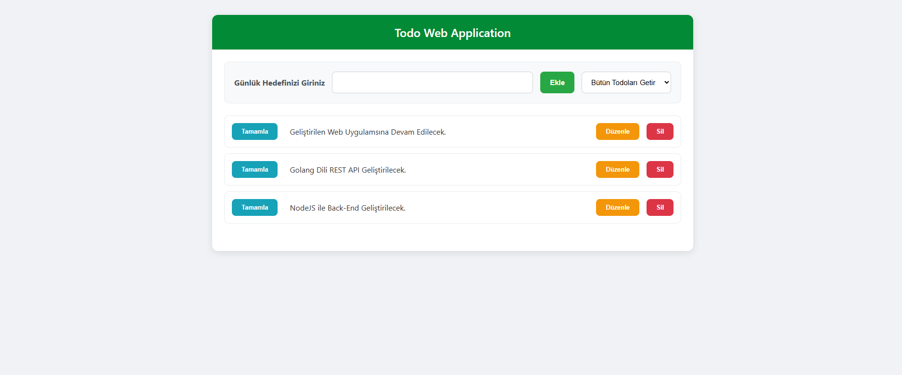

# Todo Web App 📝

HTML, CSS ve JavaScript kullanılarak geliştirilmiş, verileri tarayıcı hafızasında (LocalStorage) saklayan bir görev takip uygulaması.

*(Buraya projenin ekran görüntüsünü eklersen çok havalı durur)*

## Özellikler

* **Görev Ekleme:** Günlük hedeflerinizi listeye ekleyebilirsiniz.
* **Düzenleme (Edit):** Yanlış girilen görevleri anlık olarak güncelleyebilirsiniz.
* **Tamamlama:** Yapılan görevleri işaretleyip üzerini çizebilirsiniz.
* **Filtreleme:** Tamamlanan veya tamamlanmayan görevleri filtreleyebilirsiniz.
* **Kalıcı Hafıza:** `LocalStorage` kullanıldığı için sayfa yenilense bile verileriniz kaybolmaz.

## Kullanılan Teknolojiler

* **HTML5**
* **CSS3** (Flexbox, CSS Transitions)
* **JavaScript** (ES6+, DOM Manipulation, LocalStorage)

## Kurulum

1.  Projeyi bilgisayarınıza indirin (Clone veya Download ZIP).
2.  Klasörün içindeki `index.html` dosyasını tarayıcınızda açın.
3.  Kullanmaya başlayın!
